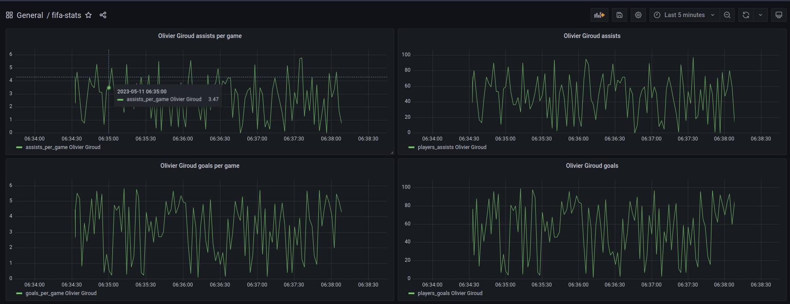

# Fifa Cards Big Data Pipeline
## Overview
The main objective of this pipeline is to help fifa players identify which cards are best to invest to and potentially get a sneak peek of the future promo cards based on the football player's performances in recent matches.
## Architecture

- Batch Processing :

The batch layers takes in the <a href="https://www.kaggle.com/datasets/sanjeetsinghnaik/fifa-23-players-dataset">Fifa 23 Players Dataset</a> and based on the fifa cards' attributes classifies into one of four tiers : S,A,B or C.
- Stream Processing :

Kafka ingests real time data and publishes them in a broker using the topic `football-stats` which will later on be passed to the spark consumer who generates more stats based on the ones he received(Goals per game,Assists per game) and saves them into the Influxdb database that will serve as a data source to Grafana to visualize the progress of the player's performance over time.
